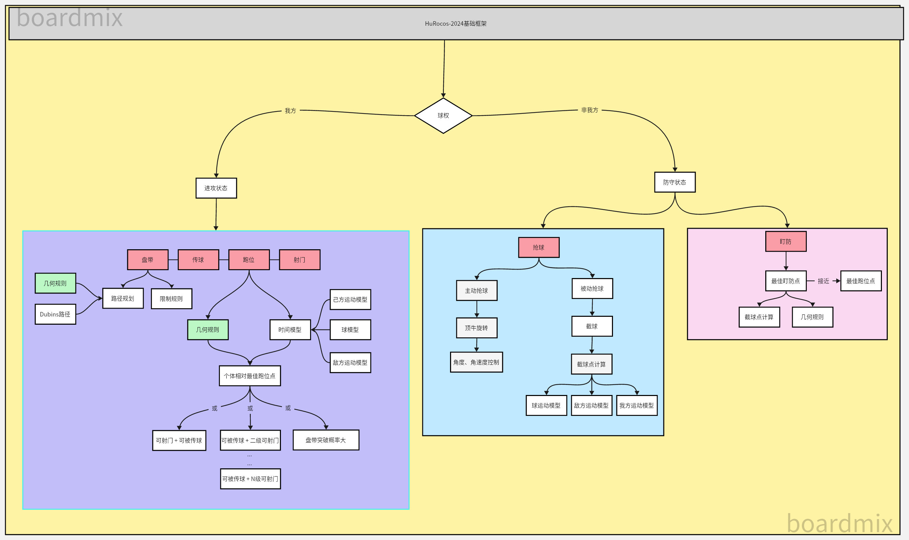

# Rocos 2024

基本框架


* [更新记录](CHANGELOG.md)
-----
* [代码规范以及基础框架](CodeFramework.md)
-----
## 常见问题
* Linux使用发射机可能会遇到串口权限不足的问题

  ```bash
  sudo usermod -a -G dialout $USER
  ```

  执行上述语句后Log Out，再次进入可以获取权限

